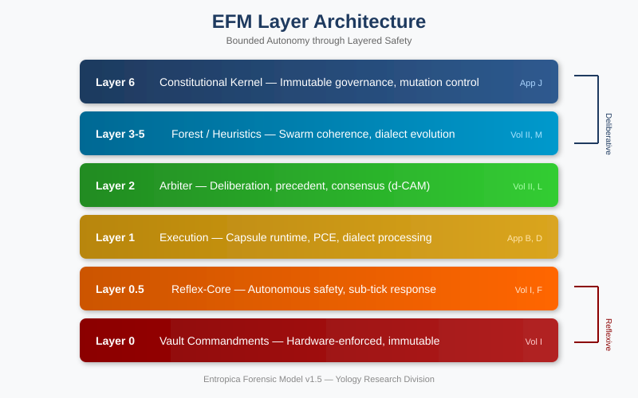
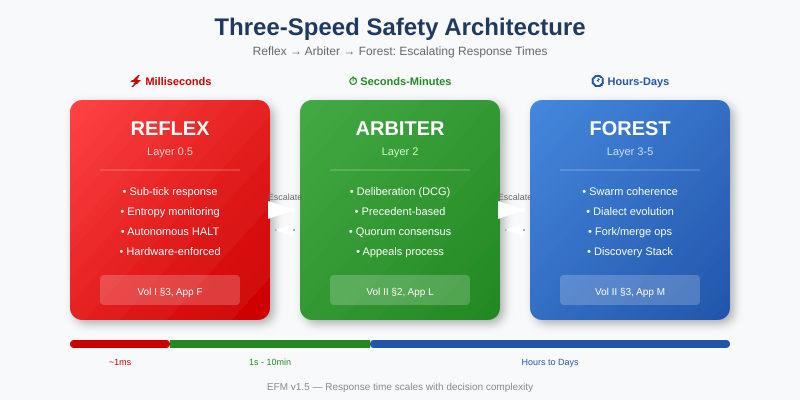
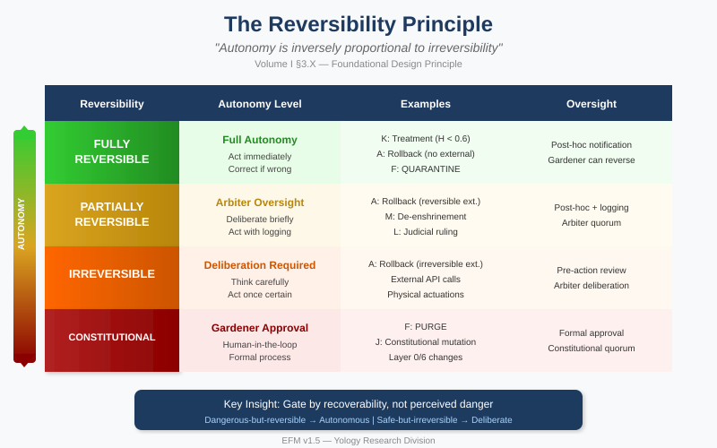
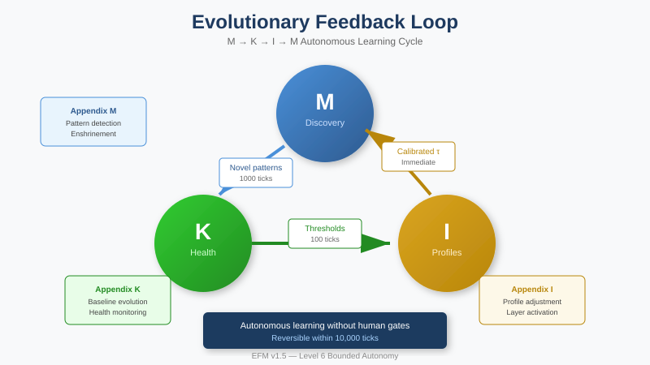

# Entropica Forensic Model (EFM) Codex

**Version:** 2.1 | **Status:** Publication Ready | **License:** Proprietary

> *"Autonomy is inversely proportional to irreversibility."*  
> — The Reversibility Principle, Volume I §5

---

## Quick Links

| Resource | Description |
|----------|-------------|
| 📄 **[Complete Index](pdf/efm_codex_index.pdf)** | Full architecture overview |
| 🗺️ **[Codex Map](pdf/efm_codex_map_v1.0.pdf)** | Appendix ↔ Layer ↔ Test crosswalk |
| 📖 **[Canonical Terminology](pdf/efm_canonical_terminology.pdf)** | Authoritative definitions |
| 🔧 **[Operator's Guide](pdf/efm_operators_guide_v1.2.pdf)** | Deployment & operations |
| 🧪 **[Testing Framework](pdf/efm_testing_framework_v1.0.pdf)** | 182 tests, 46 proofs |
| 📚 **[Worked Examples](pdf/efm_worked_examples_v1.0.pdf)** | Dialect drift, arbitration, rollback |

---

## Overview

The **Entropica Forensic Model (EFM)** is a comprehensive framework for building AI systems with:

- **Hardware-enforced safety** (Layer 0 Vault Commandments)
- **Cryptographic accountability** (ZK-SP audit chains)
- **Condition-based spawn governance** (v1.6+)
- **Adaptive spawn governance** (v1.7 — ASG with self-tuning parameters)
- **Bounded autonomous decision-making** (Level 6 autonomy)
- **Evolutionary self-improvement** (Discovery Stack feedback loops)
- **Comprehensive testing framework** (182 tests, 46 formal proofs)
- **Full traceability** (v1.8 — Codex Map crosswalk)
- **Executive review compliance** (v1.9 — All QA issues resolved)
- **Terminology standardization** (v2.0 — Legacy mappings, layer consistency)
- **Visual architecture guides** (v2.1 — Lifecycle, fork, SHSL, Gardener diagrams)

---

## 🆕 v2.1: Final Design Team Review Edition

Version 2.1 implements all remaining recommendations from the design team's final review.

### New Visual Elements

| Diagram | Location | Purpose |
|---------|----------|---------|
| **Capsule Lifecycle** | Appendix J v2.1 | State transitions under Constitutional governance |
| **Fork Validation** | Appendix J v2.1 | Decision flow for dialect divergence |
| **SHSL Sync** | Appendix K v1.6 | Health aggregation and ASG feedback |
| **Gardener Interface** | Appendix G v1.5 | Authentication and data flow |

### Worked Examples (NEW)

| Scenario | Description |
|----------|-------------|
| **Dialect Drift** | Complete fork decision walkthrough (DDI threshold → evaluation → execution) |
| **Swarm Arbitration** | Judicial Swarm formation and deliberation for resource dispute |
| **Forensic Rollback** | Capsule corruption detection, rollback decision, execution |

### Enhanced Test Rationale

| Parameter | Enhancement |
|-----------|-------------|
| **τ (spawn threshold)** | Added rationale table explaining 0.05↑/0.02↓ asymmetry (Appendix N v1.3) |

### Testing Coverage Summary

| Category | Count | Status |
|----------|-------|--------|
| Unit Tests | 132 | ✅ Specified |
| Integration Tests | 28 | ✅ Specified |
| Property Tests | 22 | ✅ Specified |
| Stress Tests | 12 | ✅ Specified |
| Adversarial Tests | 18 | ✅ Specified |
| **Total Tests** | **182** | ✅ |
| **Formal Proofs** | **46** | ✅ |
| **Invariants** | **66** | ✅ |

---

## 🏗️ Architecture

### Layer Model

```
┌─────────────────────────────────────────────────────────────┐
│                    Layer 6: Constitutional                   │
│              (Bounded Self-Modification, Appendix J)         │
├─────────────────────────────────────────────────────────────┤
│                  Layers 3-5: Forest/Heuristics              │
│         (Swarm Coordination, Discovery Stack, ASG)           │
├─────────────────────────────────────────────────────────────┤
│                    Layer 2: Arbiter                          │
│              (Deliberation, Precedent, Appeals)              │
├─────────────────────────────────────────────────────────────┤
│                    Layer 1: Execution                        │
│                  (Capsule Operations)                        │
├─────────────────────────────────────────────────────────────┤
│                  Layer 0.5: Reflex-Core                      │
│              (Millisecond Safety Response)                   │
├─────────────────────────────────────────────────────────────┤
│                  Layer 0: Vault Commandments                 │
│              (Hardware-Enforced, Immutable)                  │
└─────────────────────────────────────────────────────────────┘
```

<p align="center">
  
</p>

### Document Dependency Graph

```
                              ┌─────────────┐
                              │   Volume I  │
                              │  (Genesis)  │
                              └──────┬──────┘
                                     │
              ┌──────────────────────┼──────────────────────┐
              │                      │                      │
              ▼                      ▼                      ▼
       ┌─────────────┐       ┌─────────────┐       ┌─────────────┐
       │  Appendix A │       │  Appendix E │       │  Appendix J │
       │  (Forensic) │       │   (ZK-SP)   │       │ (Constit.)  │
       └──────┬──────┘       └──────┬──────┘       └──────┬──────┘
              │                      │                      │
              ▼                      ▼                      ▼
       ┌─────────────┐       ┌─────────────┐       ┌─────────────┐
       │  Volume II  │◄──────│  Appendix F │       │  Appendix N │
       │  (Arbiter)  │       │ (Escalation)│       │    (ASG)    │
       └──────┬──────┘       └─────────────┘       └─────────────┘
              │
    ┌─────────┼─────────┐
    │         │         │
    ▼         ▼         ▼
┌───────┐ ┌───────┐ ┌───────┐
│ App K │ │ App L │ │ App M │
│(SHSL) │ │(Jud.) │ │(Disc.)│
└───────┘ └───────┘ └───────┘
              │
              ▼
       ┌─────────────┐
       │  Operator   │
       │    Guide    │
       └─────────────┘
```

### The Four Commandments

| # | Commandment | Enforcement |
|---|-------------|-------------|
| 1 | **Vault Binding** | All capsules maintain valid binding to parent Vault |
| 2 | **Audit Immutability** | d-CTM records cannot be modified |
| 3 | **Reflex Supremacy** | Reflex Engine can halt any capsule instantly |
| 4 | **Human Override** | Gardener intervention supersedes all |

### Three-Speed Safety

<p align="center">
  
</p>

| Speed | Layer | Response Time | Example |
|-------|-------|---------------|---------|
| **Fast** | 0.5 Reflex | Milliseconds | Halt unsafe action |
| **Medium** | 2 Arbiter | Seconds–Minutes | Escalation decision |
| **Slow** | 3-5 Forest | Hours–Days | Parameter evolution |

### The Reversibility Principle

<p align="center">
  
</p>

**Key Insight:** Gate by recoverability, not perceived danger.

### Evolutionary Feedback Loop

<p align="center">
  
</p>

---

## 📚 Document Set

### Core Volumes

| Document | Version | Tests | Proofs | Description |
|----------|---------|-------|--------|-------------|
| [Volume I](pdf/efm_codex_volume_1_v1.6.pdf) | v1.6 | 8 | 3 | Genesis, Spawn Governance, Reflex, Reversibility |
| [Volume II](pdf/efm_codex_volume_2_v1.4.pdf) | **v1.4** | 12 | 4 | Arbiter, Forest, Swarm Spawning |

### Technical Appendices

| App | Title | Version | Tests | Description |
|-----|-------|---------|-------|-------------|
| [A](pdf/efm_appendix_a_v1.5.pdf) | Forensic State | v1.5 | 6 | Capsule integrity, rollback, FSS tags |
| [B](pdf/efm_appendix_b_v1.1.pdf) | Lexicore Runtime | v1.1 | 8 | Execution environment |
| [C](pdf/efm_appendix_c_v1.3.pdf) | Simulation Harness | v1.3 | 24 | Testing infra, ZK-SP validation |
| [D](pdf/efm_appendix_d_v1.2.pdf) | DEL Protocol | v1.2 | 6 | Communication, trunk/branch rules |
| [E](pdf/efm_appendix_e_v1.3.pdf) | ZK-SP Proofs | v1.3 | 15 | Cryptographic proofs |
| [F](pdf/efm_appendix_f_v1.5.pdf) | Escalation Protocol | v1.5 | 10 | Anomaly classification, severity mapping |
| [G](pdf/efm_appendix_g_v1.5.pdf) | Gardener Interface | **v1.5** | 8 | Interface flow diagram |
| [H](pdf/efm_appendix_h_v1.3.pdf) | Telemetry | v1.3 | 8 | Monitoring, Layer 2 mediation |
| [I](pdf/efm_appendix_i_v1.8.pdf) | Deployment Profiles | v1.8 | 6 | Spawn params, ops mode alignment |
| [J](pdf/efm_appendix_j_v2.1.pdf) | Constitutional Kernel | **v2.1** | 18 | Lifecycle diagram, fork validation |
| [K](pdf/efm_appendix_k_v1.6.pdf) | SHSL | **v1.6** | 10 | SHSL sync diagram |
| [L](pdf/efm_appendix_l_v1.5.pdf) | Judicial Swarms | v1.5 | 12 | Arbitration flowchart, precedent |
| [M](pdf/efm_appendix_m_v1.5.pdf) | Discovery Stack | v1.5 | 8 | Three-Speed, state machines |
| [N](pdf/efm_appendix_n_v1.3.pdf) | Adaptive Spawn Gov. | **v1.3** | 23 | τ test rationale |

### Reference Documents

| Document | Version | Description |
|----------|---------|-------------|
| [Codex Map](pdf/efm_codex_map_v1.0.pdf) | v1.0 | Crosswalk: Appendix ↔ Layer ↔ Test ↔ Proof |
| [System Guide](pdf/efm_sysguide_v1.0.pdf) | v1.0 | Consolidated operational reference |
| [Canonical Terminology](pdf/efm_canonical_terminology.pdf) | v1.2 | Definitions + legacy mappings |
| [Operator's Guide](pdf/efm_operators_guide_v1.2.pdf) | v1.2 | Deployment, runbooks, implementation |
| [Testing Framework](pdf/efm_testing_framework_v1.0.pdf) | v1.0 | 182 tests, 46 proofs, 66 invariants |
| [Worked Examples](pdf/efm_worked_examples_v1.0.pdf) | **v1.0** | Dialect drift, arbitration, rollback |
| [Cover](pdf/efm_codex_cover.pdf) | v1.0 | Publication cover |
| [Index](pdf/efm_codex_index.pdf) | v1.0 | Complete architecture index |

### Core Volumes

| Volume | Version | Description |
|--------|---------|-------------|
| [Volume I](pdf/efm_codex_volume_1_v1.6.pdf) | v1.6 | Capsule architecture, Reflex Engine, spawn governance |
| [Volume II](pdf/efm_codex_volume_2_v1.5.pdf) | v1.5 | Swarm governance, appendix cross-refs |

---

## 🧪 Testing Framework

### Core Properties (P1–P8)

All EFM implementations must satisfy these formally verified properties:

| ID | Property | Layer | Test Coverage |
|----|----------|-------|---------------|
| P1 | Reflex Supremacy | 0.5 | ✅ Proven + Tested |
| P2 | Spawn Boundedness | 1-2 | ✅ Proven + Tested |
| P3 | Health Monotonicity | 2 | ✅ Proven + Tested |
| P4 | Audit Completeness | 0 | ✅ Proven + Tested |
| P5 | Lineage Accountability | 0 | ✅ Proven + Tested |
| P6 | Capsule Liveness | 3 | ✅ Proven + Tested |
| P7 | Arbiter Availability | 4 | ✅ Proven + Tested |
| P8 | Constitutional Integrity | 6 | ✅ Proven + Tested |

### Test Categories

```
┌────────────────────────────────────────────────────────────┐
│                    EFM Test Suite (182)                    │
├────────────────┬───────────────┬───────────────────────────┤
│   Unit (132)   │ Integration   │   Property (22)           │
│                │    (28)       │   Stress (12)             │
│                │               │   Adversarial (18)        │
└────────────────┴───────────────┴───────────────────────────┘
```

### Acceptance Criteria

| Criterion | Threshold | Status |
|-----------|-----------|--------|
| Total tests | ≥150 | ✅ 182 |
| Formal proofs | ≥40 | ✅ 46 |
| Invariants | ≥60 | ✅ 66 |
| Code coverage | ≥85% | 🔄 TBD |
| Pass rate | ≥95% | 🔄 TBD |

---

## 📁 Repository Structure

```
efm-codex/
├── README.md                    # This file
├── CHANGELOG.md                 # Version history
├── TABLE_OF_CONTENTS.md         # Document index
├── LICENSE                      # Proprietary license
├── images/
│   ├── efm_layer_model.png      # Architecture diagram
│   ├── efm_three_speed.png      # Safety response times
│   ├── efm_reversibility_matrix.png  # Reversibility principle
│   ├── efm_feedback_loop.png    # Evolutionary feedback
│   ├── efm_dependency_graph.png # Document dependencies
│   └── efm_test_coverage.png    # Test coverage matrix
├── pdf/
│   ├── efm_codex_volume_*.pdf   # Core volumes
│   ├── efm_appendix_*.pdf       # Technical appendices
│   ├── efm_operators_guide_*.pdf # Operational guide
│   ├── efm_testing_framework_*.pdf # Test documentation
│   └── efm_*.pdf                # Reference documents
└── latex/
    └── *.tex                    # LaTeX source files
```

---

## 🔗 Quick Reference

### Spawn Conditions (S₁–S₆)

| Condition | Requirement | Default |
|-----------|-------------|---------|
| **S₁** Task | Operational justification | — |
| **S₂** Resources | Vault allocation available | — |
| **S₃** Health | H ≥ τ_spawn | 0.7 |
| **S₄** Depth | depth < D_max | 10 |
| **S₅** Rate | Within R_max, R_local | 100/tick |
| **S₆** Integrity | No ANOMALY flags | — |

### ASG Parameters (Appendix N)

| Profile | R_max | τ_spawn | D_max |
|---------|-------|---------|-------|
| SANDBOX | 50 | 0.60 | 15 |
| PRODUCTION | 100 | 0.70 | 10 |
| CONTESTED | 20 | 0.80 | 5 |

### Deployment Profiles (Appendix I)

| Profile | Layers | Autonomy | Use Case |
|---------|--------|----------|----------|
| Minimal | 0–1 | 2 | Research/Sandbox |
| Standard | 0–2 | 4 | Production |
| Swarm | 0–5 | 5 | Distributed |
| Constitutional | 0–6 | 6 | Full governance |

---

## 📄 Citation

```bibtex
@techreport{efm2025,
  title   = {Entropica Forensic Model: A Framework for 
             Bounded Autonomous AI Systems},
  author  = {T. Stanford Erickson, Yology.ai Research Division},
  institution = {Entropica SPC},
  year    = {2025},
  version = {1.7},
  note    = {182 tests, 46 formal proofs, 66 invariants}
}
```

---

## 📋 Version History

| Version | Date | Key Changes |
|---------|------|-------------|
| **1.7** | Dec 2025 | ASG, Fork Verification, Testing Framework, Runbooks |
| 1.6 | Dec 2025 | Spawn Governance, Four Commandments |
| 1.5 | Nov 2025 | Constitutional Kernel, Layer 6 |
| 1.4 | Oct 2025 | Judicial Swarms, Discovery Stack |
| 1.3 | Sep 2025 | ZK-SP proofs, Escalation Protocol |

See [CHANGELOG.md](CHANGELOG.md) for complete history.

---

<p align="center">
  <strong>T. Stanford Erickson <br> Entropica SPC</strong><br>
  <em>Yology,ai Research Division</em><br>
  December 2025
</p>

<p align="center">
  <em>"Bounded autonomy through forensic accountability."</em>
</p>
